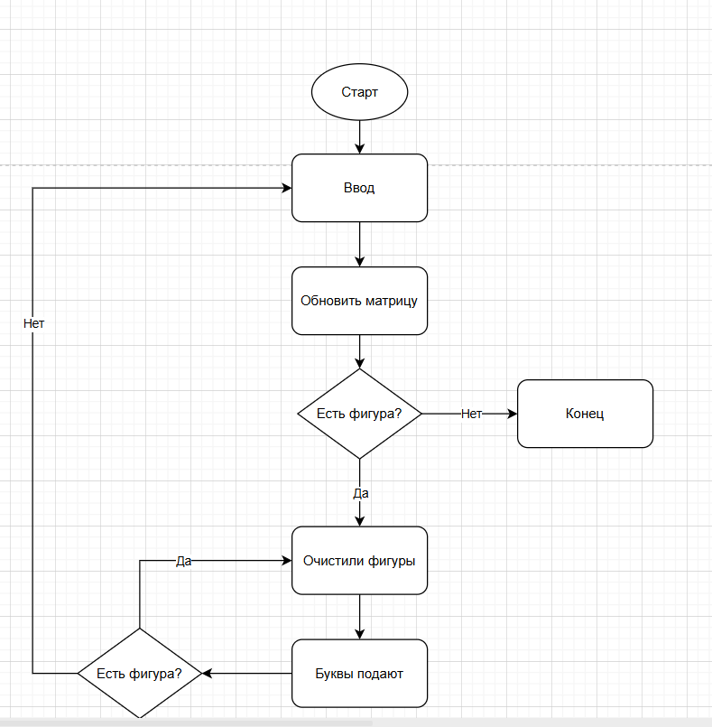

**Обработка событий**:

При взаимодействии с матрицей все команды АТД Matrix оборачиваются в классы-команды. 
- Command - родительский класс.
- SwapCommand - для перестановки букв при введении пользователем координат на перестановку. 
- CleanCommand - для очистки фигур.
- FillCommand - для заполнения пустых клеток. 

Бонусы будут начисляться с использованием паттерна Наблюдатель. При вызове метода cleanFigures у Matrix будет оповещаться наблюдатель, который будет запускать начисление бонусов. 

Вывод в консоль также будет реализован с использованием паттерна Наблюдатель. Если выбран режим, где вывод в консоль происходит после каждого шага экрана, то будет создан Слушатель, который будет печатать матрицу в консоль после каждого вызова како-либо команды у Матрицы.

**Схемы создания объектов**:

Matrix - создается и заполняется через статический метод. 

Команды - будут создаваться через абстрактную Фабрику.

**Типовой сценарий**:

**Тесты**:
Нужны тесты для следующих сценариев:
- Пользователь ввел некорректные координаты для перестановки
- После ввода пользователя нет фигуры
- После ввода пользователя появилось несколько фигур
- После очистки фигур и заполнения пустых клеток появилась еще фигура
- После очистки фигур и заполнения пустых клеток появились еще фигура - несколько итераций
- Сложные формы фигур
